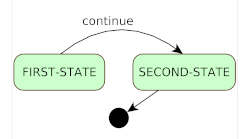

# state-machine

This repo contains a [state machine API](src/main/java/com/webotech/statemachine/api) with a generic
[implementation](src/main/java/com/webotech/statemachine/GenericStateMachine.java) written in core
java that is thread safe.

- State machine API with comprehensive javadoc
- Generic implementation
- Core java: no dependencies (other than a logging API)
- Thread safe
- Extensively tested

You can find how core [concepts of a state machine](docs/01-intro.md) are implemented in the
[documentation](docs/02-implementation.md) or you can dive directly into the code.

The integration tests are useful to show various usecases for `state-machine`. Please note that
tests are designed to run on systems with UNIX style line endings.

**Note** although the current version is being used in production on a number of projects, the logic
is still undergoing significant changes. You may want to wait for a major release version (1.0.0)
when it will become more stable.

## Use state-machine with maven or gradle

This project is
in [maven central](https://central.sonatype.com/artifact/com.webotech/state-machine), to start using
it just add this dependency to your POM

```xml
<dependency>
    <groupId>com.webotech</groupId>
    <artifactId>state-machine</artifactId>
    <version>0.8.0</version>
</dependency>
```

or this dependency in gradle

```groovy
implementation 'com.webotech:state-machine:0.8.0'
```

**Please use the latest version available in maven central - the version in this page may be old.**

## Quick start example

```java
// Define the states
State<Void, Void> firstState = new NamedState<Void, Void>("FIRST-STATE");
State<Void, Void> secondState = new NamedState<Void, Void>("SECOND-STATE");

// Define the events
StateEvent<Void> continueEvt = new NamedStateEvent<>("continue");

// Define entry/exit actions
firstState.appendEntryActions((ev, sm) -> {
  System.out.println("Start in " + sm.getCurrentState());
  sm.fire(continueEvt);
});
firstState.appendExitActions((ev, sm) -> {
  System.out.println(ev + " caused transition away from " + sm.getCurrentState());
});
secondState.appendEntryActions((ev, sm) -> {
  System.out.println(ev + " caused transition to " + sm.getCurrentState());
});

// Build the state machine
StateMachine<Void, Void> stateMachine = new GenericStateMachine.Builder<Void, Void>().build()
    .initialSate(firstState).receives(continueEvt).itTransitionsTo(secondState)
    .when(secondState).itEnds();

// Start it
stateMachine.start();
```

Running the above code will print this to STDOUT:

```
Start in NamedState[FIRST-STATE]
NamedStateEvent[continue] caused transition away from NamedState[FIRST-STATE]
NamedStateEvent[continue] caused transition to NamedState[SECOND-STATE]
```

The state diagram for this example is:


