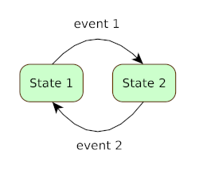

## Events in the state machine

### Threading considerations

Typically you configure a `StateMachine` on the app's primary thread, while events originate on I/O
theads like a messaging or RPC thread. `GenericStatMachine` is thread safe so you won't get any
unexpected side effects. Actually the separation that results from using I/O threads helps prevent a
situation where circular execution causes a `StackOverflowError`.

Imagine a 2 state machine where each `State` has a single entry `StateAction` that does nothing
other than fire an event.



In code, the `StateAction`s would look something like this:

```
StateAction<> action1 = sm -> sm.fire(event1);
StateAction<> action2 = sm -> sm.fire(event2);
```

When in `State 1`, the state machine would immediately transition to `State 2` which would cause it
to immediately transition back to `State 1` and so on. Since this is all done on a single thread,
the `StateMachine` enters an unending circular pattern that constantly increases the thread's stack,
ultimately leading to a `StackOverflowError`.

You can avoid this error by using
the [EventManager](../src/main/java/com/webotech/statemachine/EventManager.java) which
has `fireAsync(StateEvent)` and `fireBound(StateEvent)` methods. By using `fireAsync(completeEvt)`
in the `StateAction`s above, the `StateMachine` would continously transition between states without
causing any errors. The `StateAction` code would look something like this:

```
StateAction<> action1 = sm -> {
  EventManager eventManager = sm.getContext().getEventManager();
  eventManager.fireAsync(event1);
};
```

Although this is a contrived example, it does highlight the point that you need to put some thought
into how you fire events in your code. The exact way you do this will be dependant on the app's
threading model. Having a clear understanding of your threading model is important so you can
optimise the app's performance,
the [EventManager](../src/main/java/com/webotech/statemachine/EventManager.java) is one of the tools
that will help you do this.

### Thread safety in `GenericStateMachine`

`GenericStateMachine` is thread safe, so when events are received on multiple threads there will be
no unexpected side effects. The first event that is received will cause a transition to take place
in an atomic way, so that the next event will be processed once the transition is complete (in the
subsequent state). It does this by using `AtomicBoolean`s as a barrier.

In order to minimise object churn at runtime, by default the `AtomicBoolean`s are kept in a simple
object pool and they get recycled during transitions. You can also choose to use your own mechanism
for providing the `AtomicBoolean`s using the `withAtomicBooleanPool()` method on the builder that
takes a supplier and a consumer:

```
//This will use a new AtomicBoolean for every transition which will need to be cleaned up by the GC
StateMachine<> sm = new GenericStateMachine.Builder<>()
    .withAtomicBooleanPool(() -> new::AtomicBoolean, ab -> {}).build();
```

### Unmapped events

While using the `StateMachine` you may come across situations where a `State` receives
a `StateEvent` that has not been mapped during configuration. By default `GenericStateMachine`
simply logs the details and ignores it, in messaging terms this is equivalent to dropping a message.
However, you may want bespoke behaviour for unmapped events in which case you can build
the `GenericStateMachine` with an unmapped event handler:

```
BiConsumer<StateEvent<>, StateMachine<>> unmappedHandler = ...;
StateMachine<> sm = new GenericStateMachine.Builder<>().setUnmappedEventHander(unmappedHandler);
```

The handler is a `BiConsumer` that calls back with a reference to the `StateEvent` that was received
and the `StateMachine`.

### Event payloads

When events are driven by rich data messages like FIX messages during electronic trading, it
can be convenient for the data in the message to be available to the `StateAction` as you may need
to extract values from it in the processing logic. To facilitate this, the `StateEvent` allows a
generic payload to be set on it which can then be accessed by the `StateAction` when it is being
executed.

Note that in many cases the payload of a `StateEvent` is not needed in which case you can define it
as `Void`.

### Duplicate events

If a `StateEvent` is received while the same `StateEvent` is being processed, by
default `GenericStateMachine` will log it as a duplicate and ignore it. In most cases this is
desirable but it could be that your logic relies upon processing _all_ `StateEvent` payloads or you
wish to process the `StateEvent` after the transition has completed. For these cases duplicate
events cannot be ignored and you will need to build the`StateMachine` as follows:

```
//The StateMachine will not drop duplicate events
StateMachine<> sm = new GenericStateMachine.Builder<>().processDuplicateEvents().build();
```
