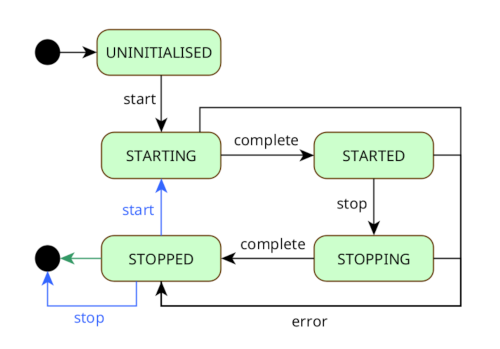

## Service API & app starter implementation

This project also contains a
[service API](../src/main/java/com/webotech/statemachine/service/api/AppService.java) which defines
the basics of an application (or service). Abstract classes located in the
[com.webotech.statemachine.service](../src/main/java/com/webotech/statemachine/service) package,
form a starter implementation that will run as a stand-alone app. The app is backed by a state
machine.

The API and implementation are the blueprint for a generic microservice.

## App design

The implementation is intentionally minimal and is for an app that is started and stopped in a
predictable and graceful manner. Here is the state diagram:



Note that in the **STOPPED** state, it can exit immediately (denoted in green) or can process
**start** and **stop** events (denoted in blue). These two modes of operation are controlled at
construction with an _isExitOnStop_ flag.

Once an [AppService](../src/main/java/com/webotech/statemachine/service/api/AppService.java) is
constructed, it will transition from an **UNINITIALISED** state to a **STARTING** state and then to
a **STARTED** state. During the **STARTING** state, constructed subsystems are started in a
sequential manner. Once all have started, the app transitions to a **STARTED** state. It will run
indefinitely, servicing any operations that are needed and will also process a **stop** event which
will cause it to gracefully wind down.

During wind down, the app transitions to a **STOPPING** state and all subsystems are stopped in
reverse order to how they were started. When subsystems are stopped they return to their constructed
state and when all are stopped, the app transitions to a **STOPPED** state.

As mentioned earler an app can be constructed with _isExitOnStop_ set to true or false, this
dictates it's mode of operation. In the 'exit on stop' mode, the app will exit immediately once it
is in the **STOPPED** state. Otherwise the app will continue to run as a warm standby that can be
revived when it will transition to the **STARTED** state again.

### API

The core API for an app is defined in
[AppService](../src/main/java/com/webotech/statemachine/service/api/AppService.java) which has
_start_ and _stop_ lifecycle methods that are analogous to the **start** and **stop** events in the
state diagram. There is also an _error_ method which can be used to propagate unhandled exceptions
so that the app will transition to **STOPPED**. The framework takes care of the **complete** events
that are used to drive the predictable starting and stopping of the app. The API also has a
_getAppContext_ method that provides access to the context of the app.

The [AppContext](../src/main/java/com/webotech/statemachine/service/api/AppContext.java) is used to
store the app level state, it has the app name, the arguments used to start the app (analogous to
the args in a main method) and the list of
[Subsystems](../src/main/java/com/webotech/statemachine/service/api/Subsystem.java) that are used to
build the app's business logic.

Finally, a [Subsystem](../src/main/java/com/webotech/statemachine/service/api/Subsystem.java) has
lifecycle _start_ and _stop_ methods that need to contain logic for starting and stopping the
subsystem.

### Core classes

The framework consists of 2 classes that should be extended

- [AbstractAppService](../src/main/java/com/webotech/statemachine/service/AbstractAppService.java)
  implements AppService and should be extended to include bespoke business logic as well as a main
  method used for bootstrapping
- [AbstractAppContext](../src/main/java/com/webotech/statemachine/service/AbstractAppContext.java)
  implements AppContext and should be extended to house any app level state needed by bespoke
  business logic

There are no implementations
of [Subsystem](../src/main/java/com/webotech/statemachine/service/api/Subsystem.java) since each app
will need bespoke implementations that house start and stop logic. It is up to app developers to
ensure that the stop logic is the inverse of the start logic, the intention being that the stop
logic will re-establish the subystem's state to what it was before the start logic was called.

### Steps to create an app

These are the typical steps needed to create an app.

1. Create a concrete class that
   extends [AbstractAppService](../src/main/java/com/webotech/statemachine/service/AbstractAppService.java)
   this should contain a simple main method for bootstrapping.
   The [ExampleApp](../src/test/java/com/webotech/statemachine/service/ExampleApp.java) shows you
   how.
2. Create a concrete class that
   extends [AbstractAppContext](../src/main/java/com/webotech/statemachine/service/AbstractAppContext.java).
   You can see
   how [ExampleAppContext](../src/test/java/com/webotech/statemachine/service/ExampleAppContext.java)
   does it.
3. Create as many implementations
   of [Subsystem](../src/main/java/com/webotech/statemachine/service/api/Subsystem.java) as
   required. It is a good idea for each subsytem to have a single responsibility for example 'setup
   application properties' or 'connect to a database'. Ensure that the stop method re-establishes
   the state of the subsystem to what it was after construction.

As you can see in [ExampleApp](../src/test/java/com/webotech/statemachine/service/ExampleApp.java),
bootstrapping an application requires you to construct it like

```java
ExampleApp app = new ExampleApp(new ExampleAppContext().withSubsystems(
                  List.of(new ExampleSubsystem())));
```

and then start it like

```java
app.start();
```