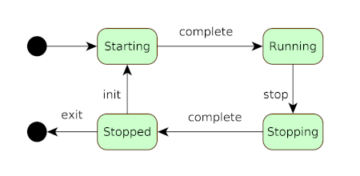

# `com.webotech:state-machine` in depth

Now that [state machine basics](intro.md) are covered, I will explain how the code works. These are
the topics that are covered

* the state machine API
* how to configure a state machine
* what happens at runtime
* examples

## The state machine API

The API for the state machine is in the
[com.webotech.statemachine.api](../src/main/java/com/webotech/statemachine/api) package. Here you
will find the interfaces that define
the [StateMachine](../src/main/java/com/webotech/statemachine/api/StateMachine.java) and related
objects. Everything in the package has comprehensive javadocs to remind you how things work while
you are coding.

## Configuring a state machine

Before the state machine is started, you need to configure it with states, events and transitions.
In [StateMachine](../src/main/java/com/webotech/statemachine/api/StateMachine.java) there are a
number of methods that are clearly documented as being for this purpose. Once configuration is done,
you will need to start the state machine so that it can start processing events.

The API has been written so that the configuration method names are aligned with natural language.
This is how the [application lifecycle](intro.md#app-lifecycle-example) example would be configured.
Here is the state diagram:



Configuration is done by following these steps (I've omitted defining generic types for
brevity).

```
//define the states
State<> starting = new NamedState<>("STARTING");
State<> running = new NamedState<>("RUNNING");
State<> stopping = new NamedState<>("STOPPING");
State<> stopped = new NamedState<>("STOPPED");

//define the events
StateEvent<> completeEvt = new NamedStateEvent("complete");
StateEvent<> stopEvt = new NamedStateEvent("stop");
StateEvent<> initEvt = new NamedStateEvent("init");
StateEvent<> exitEvt = new NamedStateEvent("exit");

//configure the state machine
StateMachine<> sm = (new GenericStateMachine.Builder<>()).build();
sm = sm.initialState(starting).receives(completeEvt).itTransitionsTo(running)
     when(running).receives(stopEvt).itTransitionsTo(stopping)
     when(stopping).receives(completeEvt).itTransitionsTo(stopped)
     when(stopped).receives(initEvt).itTransitionsTo(starting)
     when(stopped).receives(exitEvent).itEnds();
```

At this point the state machine can be started, and it would behave as defined in the diagram but
simple transitions have limited use. Imagine that during the starting state you want the app to
carry out these 3 actions

1. read config from property files
2. use the config to start a connection pool to a database
3. fire a `completeEvt` so that the state machine transitions to `running`

The way this is done is by appending `StateAction`s to a `State`. The API
for [State](../src/main/java/com/webotech/statemachine/api/State.java)
has `appendEntryActions(StateAction...)` for actions you want to execute when the state machine
transitions to a state to and `appendExitActions(StateAction...)` for actions you want to execute
when the state machine transitions away from a state.

In this case you need to add the logic for the actions outlined above in
individual [StateAction](../src/main/java/com/webotech/statemachine/api/StateAction.java)s and then
append them to the `State` as entry actions. When the `starting` state is entered the actions will
execute in the order that they were appended. It is important for them to be executed in a
predictable order because in this case reading the config from property files (action 1) has to
happen before the config is used to connect to a database (action 2).

Finally, the `completeEvt` is fired (action 3) which causes the state machine to transition. For
the `GenericStatMachine` implementation, firing an event needs some thought. Generally speaking
events originate on a different thread form the one that executes the state machine, for example a
messaging thread or an RPC thread. `GenericStatMachine` is thread safe so you won't get any
unexpected side effects. In this case the `completeEvt` originates from a `StateAction` which is
part of the internal execution of `GenericStateMachine`, it is better to fire the event on a
separate thread. You can do this easily by
using [EventManager](../src/main/java/com/webotech/statemachine/EventManager.java) which
has `fireAsync(StateEvent)` and `fireBound(StateEvent)` methods. In this
case `fireAsync(completeEvt)` is needed.

Here is some pseudo code illustrating how the `StateAction`s are added to the `starting` State:

```
//define actions
StateAction<> readConfigAction = sm -> {
 /* Read config from property files and put the config on StateMachine 
 context using sm.getContext() so it can be accessed by other StateActions */
}
StateAction<> initDbaAction = sm -> {
 /* Get the database connection config using sm.getContext() 
 and init a connection pool to the database */
}
StateAction<> completeAction = sm -> {
 EventManager eventManager = sm.getContext().getEventManager();
 eventManager.fireAsync(completeEvt);
}
starting.appendEntryActions(readConfigAction, initDbaAction, completeAction);
```

In the above code you will notice the idea of a context for the state machine. It is not necessary
in many cases to use one (in which case define it as `Void`) but in others it is a conventient place
to store data which is for the state machine's use. The context is a free form generic type and is
available to the `StateMachine`, the `StateAction`s and the `StatMachineListener`. It has 2
purposes:

1. allow data to be exchanged between `StateAction`s
2. act as a service locator that provides objects needed by the state machine

TODO