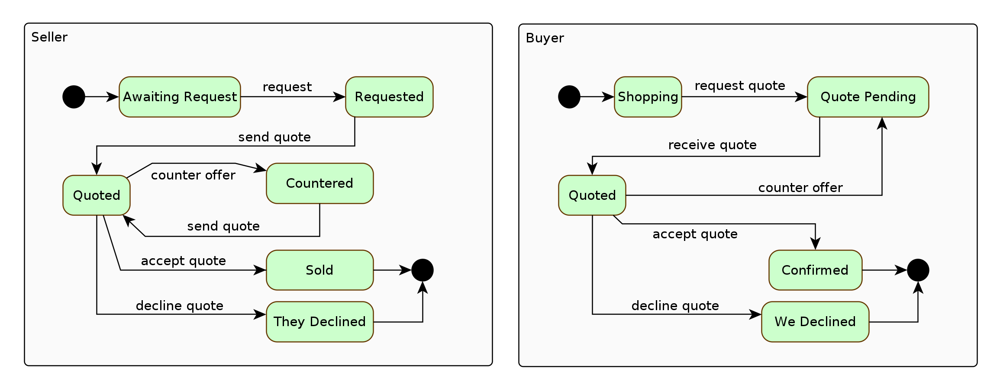

# State Machine Concepts

## What is a state machine?

A state machine defines the state of a system or subsystem. It ensures that

* the system can only be in a single state at a time
* transitions between states are managed

This is done by making sure the transitions are

* prescribed
* carried out in an orderly manner

## How a state machine works

These high level concepts describe how a state machine works.

At its core

1. when a state machine is in a given state
2. it receives an event
3. which causes it to transition to a new state

Here is a state diagram that illustrates a simple 2 state machine:

When **State 1** receives **event 1** it transitions to **State 2**. When **State 2** receives
**event 2** it transitions to **State 1**.

## Uses of state machines

Using a state machine promotes single responsibility so there are many situations where it is
beneficial to build one into the design of an app. Appropriate use of a state machine will help code
to be better organised, easier to maintain and easier to enhance.

In the next sections I have outlined a couple of examples.

### App Lifecycle Example

The lifecycle of an application can be managed by a state machine. A machine with these states

* **Starting**
* **Running**
* **Stopping**
* **Stopped**

could be used for this purpose. Here's the state diagram:

The **Starting** state would be used for bootstrapping tasks, like processing configuration,
initialising database connections and starting up I/O. Once bootstrapping is complete, a transition
to the **Running** state would indicate the normal operation of the app. The **Stopping** state
would be used to gracefully bring all subsystems back to their initial (constructed but idle)
states. Then once transition to the **Stopped** state completes, the application could exit or could
be made to transition back to the **Starting** state. In this case the **Stopped** state would be
used to put an application into a warm stand-by mode which can be a very useful feature.

### State Driven Protocol

In a state driven protocol, distinct systems communicate asynchronously with each other, often
using messaging. One system sends a message to the other and then waits to receive a response
message before continuing with the execution of its business logic. This is a very common scenario,
for example in e-commerce order flows, electronic trading and e-government processes to mention a
few.

Here is a basic example based on negotiating the price of a product. Imagine an organisation,
Seller, that sells products with an indicative price tag. Since the price is indicative, they allow
it to be negotiated down. Another organisation, Buyer, purchases the kind of product that Seller
sells but only if the price is good enough.

Here are the state diagrams for Seller and Buyer:

Even in this simple example there is some complexity. In the real world, state diagrams tend to be a
lot more complex and evolve as requirements change. Apps that model these states with a state
machine are more likely to be able to keep up with a modern business approach where requirements are
dynamic.

For example in this scenario, Seller might want to introduce a new **accept** event when the process
is in the **Countered** state, resulting in a transition to the **Sold** state. This can be achieved
by reconfiguring the state machine. Because logic is compartmentalised in areas of single
responsibility, adapting a design by introducing new states/events can be done while minimising
technical risk.
